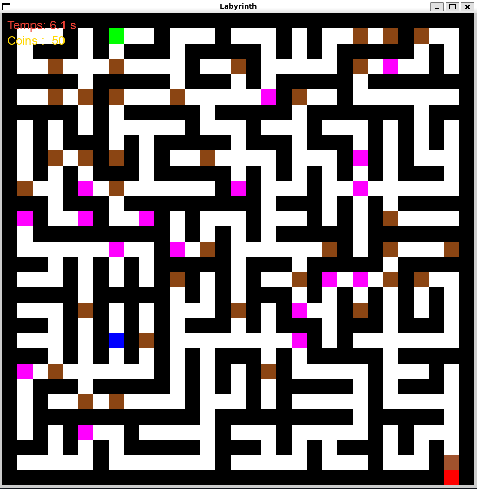

# 🌀 Labyrinth-Generator

Un générateur et explorateur de labyrinthes interactif en **C / SDL2**.  
Crée, explore et survis à un labyrinthe rempli de **pièges**, **coffres**, et **clés**, le tout avec une interface graphique en SDL2.

---

## 🧩 Aperçu



---

## ⚙️ Fonctionnalités

- **Génération procédurale** du labyrinthe à partir d’une graine pseudo-aléatoire  
- **Gestion des murs, chemins, clés, coffres et pièges**  
- **Déplacement du joueur** en temps réel (ZQSD ou flèches)  
- **Interface graphique** avec affichage du temps et des points (via SDL2 + SDL_ttf)  
- **Sauvegarde / chargement** de configurations (`config/*.cfg`)  
- **Score dynamique** : chaque action influe sur votre nombre de pièces 💰
- **Sauvegarde locale** : Sauvegarde locale à la fin de chaque partie  (`score/*.score`) 

---

## 🏗️ Installation

### 1️⃣ Cloner le dépôt
```bash
git clone https://github.com/waylow1/Labyrinth-Generator.git
cd Labyrinth-Generator
```

### 2️⃣ Installer les dépendances
Assurez-vous d’avoir **SDL2** et **SDL2_ttf** installés sur votre système :

#### 🐧 Sur Linux :
```bash
sudo apt install libsdl2-dev libsdl2-ttf-dev
```

#### 🍎 Sur macOS (Homebrew) :
```bash
brew install sdl2 sdl2_ttf
```

---

## 🧱 Compilation

Compilez l’application avec :

```bash
make
```

Le binaire sera généré dans `bin/labyrinth`.

---

## ▶️ Exécution

Pour lancer l’application :

```bash
./bin/labyrinth
```

L’application vous proposera :
- soit de **charger un labyrinthe** depuis `config/`,
- soit d’en **générer un nouveau** à partir d’une graine aléatoire.

Les fichiers `.cfg` contiennent les paramètres de génération :
```
<seed>,<lines>,<columns>
```

---

## 🎮 Commandes

| Touche | Action |
|:------:|:--------|
| Z / ↑ | Déplacer vers le haut |
| S / ↓ | Déplacer vers le bas |
| Q / ← | Déplacer vers la gauche |
| D / → | Déplacer vers la droite |

---

## 💡 Éléments du jeu

| Élément | Description |
|----------|--------------|
| 🧍 | Joueur |
| 🧱 | Mur (infranchissable) |
| 🔑 | Clé (nécessaire pour sortir) |
| 🎁 | Coffre (+1000 pièces) |
| 💀 | Piège (-500 pièces) |
| 🚪 | Sortie (accessible uniquement avec la clé) |

---

## 🧮 Système de score

- Chaque **déplacement** coûte 1 pièce 💰  
- Ouvrir un **coffre** rapporte +1000 💎  
- Marcher sur un **piège** fait perdre -500 ☠️  
- Le score final est calculé à la fin de la partie.

---

## 🧰 Arborescence du projet

```
Labyrinth-Generator/
├── asset/
│   ├── lab.png
│   └── arial.ttf
├── bin/
│   └── labyrinth
├── config/
│   └── *.cfg
├── include/
│   ├── utils.h
│   ├── labyrinth_generator.h
│   ├── labyrinth_player_movement.h
│   ├── labyrinth_score.h
│   └── ...
├── src/
│   ├── main.c
│   ├── utils.c
│   ├── labyrinth_generator.c
│   ├── labyrinth_player_movement.c
│   └── ...
├── Makefile
└── README.md
```

---

## 🧠 Architecture & modules principaux

### `utils.c`
Gestion mémoire, création/suppression de matrices, chargement et sauvegarde de labyrinthes.

### `labyrinth_generator.c`
Algorithme de **fusion d’ensembles (Union-Find simplifié)** pour créer un labyrinthe parfait.  
Ajoute ensuite des objets, pièges et points de départ/arrivée.

### `labyrinth_player_movement.c`
Gestion du joueur, des collisions et de l’affichage SDL2 (temps, score, interactions).

---

## 🧾 Licence

Projet libre sous licence **MIT**.  
Créé par [@waylow1](https://github.com/waylow1).

---
